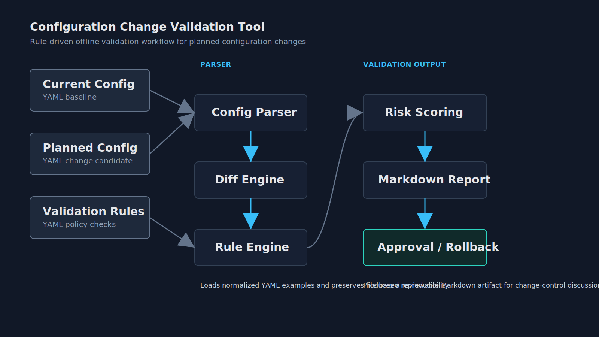
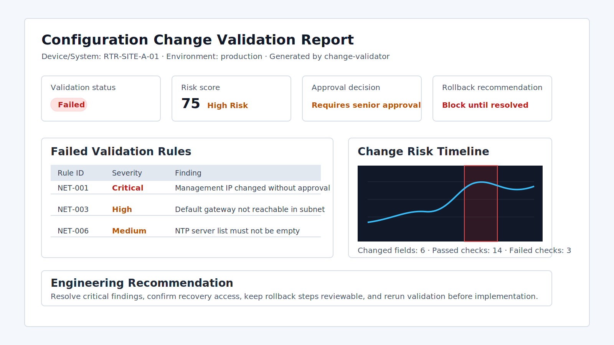

# Configuration Change Validation Tool

[](https://github.com/omidrahimirad/config-change-validation-tool/actions/workflows/ci.yml)


Rule-driven configuration change validation CLI for network, RAN-like, and industrial system examples.

The tool compares current and planned YAML configuration files, applies YAML-defined engineering rules, calculates operational risk, and generates a Markdown report with an approval checklist and rollback recommendation.

## Problem Statement

Configuration changes can be syntactically valid while still being operationally risky. A planned file may parse correctly but remove recovery access, change a management address without approval, break gateway reachability, or miss a maintenance window.

This project turns repeated manual review checks into a reproducible CLI workflow that produces reviewable evidence before implementation.

## Why This Project Exists

Change reviews in integration, telecom, network, and infrastructure environments often depend on consistent pre-checks:

- Is recovery access still available?
- Are subnet and gateway changes consistent?
- Is a maintenance window defined?
- Is a rollback plan documented?
- Does the change require senior approval?

The project demonstrates how those review patterns can be encoded as deterministic rules, tested, and documented without connecting to live systems.

## Architecture / Workflow



The validation pipeline is intentionally compact:

1. Load current configuration, planned configuration, and validation rules from YAML.
2. Parse and normalize the file-based inputs.
3. Compute changed fields with a recursive diff engine.
4. Apply rule checks against planned values and detected changes.
5. Convert failed rule severities into a risk score.
6. Generate a Markdown report with approval and rollback guidance.

## Supported Validation Domains

The included examples are synthetic and safe to publish, but they reflect practical review concerns from several engineering domains.

Network configuration:

- device ID, site, device type, and management IP
- uplink and service interfaces
- default gateway and static routes
- SSH, SNMP, and NTP settings

Telecom / RAN-like configuration:

- cell ID, site, band, PCI, and TAC
- TX power and handover margin
- neighbor cell list

System / industrial controller configuration:

- system ID and environment
- redundancy and backup readiness
- logging level, maintenance window, and rollback plan

## Rule Types

Rules are stored in YAML and evaluated by the rule engine. Implemented check types:

- `range`
- `must_equal`
- `not_empty`
- `max_delta`
- `no_change_without_approval`
- `subnet_consistency`
- `required_if_environment_production`
- `requires_rollback_plan`
- `required_if_risk_high`

Example rules:

- `NET-001`: Management IP must not change without approval.
- `NET-003`: Default gateway must be reachable in the same subnet.
- `RAN-002`: TX power change above 3 dB requires high-risk approval.
- `OPS-002`: Backup must be confirmed before change.

## Risk Scoring

Failed checks are scored by severity:

| Severity | Points |
| --- | ---: |
| Critical | 40 |
| High | 25 |
| Medium | 10 |
| Low | 5 |

Risk levels:

| Score | Risk level | Decision |
| ---: | --- | --- |
| 0-20 | Low Risk | Approved |
| 21-50 | Medium Risk | Approved with review |
| 51-90 | High Risk | Requires senior approval |
| 90+ | Critical Risk | Rejected / blocked |

## Installation

Install uv if needed:

```bash
curl -LsSf https://astral.sh/uv/install.sh | sh
```

Create the project environment from `pyproject.toml` and `uv.lock`:

```bash
uv sync
```

## CLI Usage

Run the network validation example:

```bash
uv run python -m change_validator validate \
  --current configs/current/router_site_a.yaml \
  --planned configs/planned/router_site_a.yaml \
  --rules rules/network_rules.yaml \
  --output reports/router_site_a_change_report.md
```

The console entry point is also available through uv:

```bash
uv run change-validator validate \
  --current configs/current/router_site_a.yaml \
  --planned configs/planned/router_site_a.yaml \
  --rules rules/network_rules.yaml \
  --output reports/router_site_a_change_report.md
```

Regenerate all included sample reports:

```bash
uv run change-validator validate \
  --current configs/current/router_site_a.yaml \
  --planned configs/planned/router_site_a.yaml \
  --rules rules/network_rules.yaml \
  --output reports/router_site_a_change_report.md

uv run change-validator validate \
  --current configs/current/ran_cell_001.yaml \
  --planned configs/planned/ran_cell_001.yaml \
  --rules rules/ran_rules.yaml \
  --output reports/ran_cell_001_change_report.md

uv run change-validator validate \
  --current configs/current/controller_01.yaml \
  --planned configs/planned/controller_01.yaml \
  --rules rules/system_rules.yaml \
  --output reports/controller_01_change_report.md
```

## Example Reports / Output Preview



The router example flags a risky planned change before implementation. It identifies a management IP change without approval, a default gateway/subnet mismatch, and an empty NTP server list.

```text
Validation completed.

Changed fields: 6
Passed checks: 14
Failed checks: 3
Risk score: 75
Risk level: HIGH
Decision: REQUIRES SENIOR APPROVAL

Report saved to:
reports/router_site_a_change_report.md
```

Report artifacts:

- CLI output: [docs/assets/cli-output-router-site-a.txt](docs/assets/cli-output-router-site-a.txt)
- Report excerpt: [docs/assets/router-site-a-report-preview.md](docs/assets/router-site-a-report-preview.md)
- Full generated report: [reports/router_site_a_change_report.md](reports/router_site_a_change_report.md)
- Approved RAN-like example: [examples/approved_change_example.md](examples/approved_change_example.md)
- Failed network example: [examples/failed_change_example.md](examples/failed_change_example.md)
- Rollback checklist: [examples/rollback_checklist.md](examples/rollback_checklist.md)

## Development and QA

Run the complete local verification set:

```bash
uv sync
uv lock --check
uv run pytest -v
uv run pytest --cov=src --cov-report=term-missing
uv run ruff check .
uv run ruff format --check .
uv run mypy src
```

The GitHub Actions workflow installs uv, syncs dependencies from `uv.lock`, runs Ruff, runs mypy, runs pytest with coverage, and performs CLI smoke tests on every push and pull request.

## Engineering Relevance

This project is relevant to roles where configuration changes need to be reviewed consistently, documented clearly, and approved based on operational impact rather than file syntax alone.

It demonstrates:

- rule-driven validation logic
- file-based reproducibility
- CLI automation
- testable change-control checks
- risk scoring and approval mapping
- generated Markdown evidence for review

Interview preparation notes are available in [docs/interview_notes.md](docs/interview_notes.md).

Design decisions are documented in [docs/design_tradeoffs.md](docs/design_tradeoffs.md).

## Limitations

This is not a production orchestration platform.

- Configuration data is synthetic and intentionally limited to representative examples.
- Inputs are normalized YAML examples, not native vendor configuration formats.
- The tool does not connect to live routers, OSS platforms, industrial controllers, ticketing systems, approval systems, or deployment pipelines.
- Rollback output is advisory documentation only.
- There is no authentication, RBAC, distributed approval state, or audit-log backend.
- The rule engine is intentionally compact and does not model every operational dependency or vendor-specific exception.

## Future Improvements

- Vendor-specific parsers
- Stricter schema validation for each domain
- Ticket-system integration
- CI/CD approval gates
- Audit logs and RBAC
- Batch validation for many devices
- Pre/post telemetry checks
- GitLab/Jenkins integration
- HTML or PDF report export

## Author

Omid Rahimi

- GitHub: [omidrahimirad](https://github.com/omidrahimirad)
- LinkedIn: _Add LinkedIn profile URL_

## License

This project is released under the [MIT License](LICENSE).

## Disclaimer

This project uses synthetic configuration data and simplified validation rules. It is inspired by real change-control workflows, but it is not connected to any live operator, railway, or industrial system.
